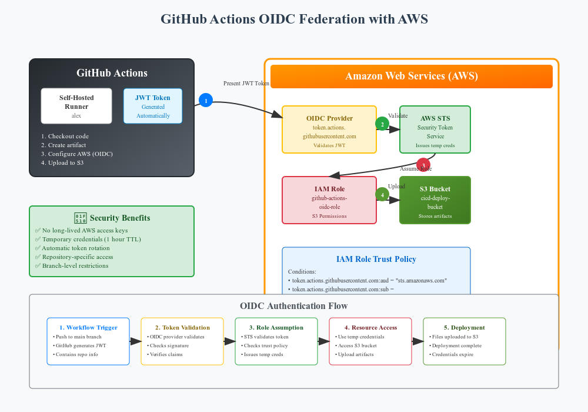

## 📂 Architecture

1. Complete Documentation

✅ Learning objectives and overview
✅ Architecture comparison (Traditional vs OIDC)
✅ Step-by-step setup instructions
✅ Project structure explanation
✅ Troubleshooting guide

2. Visual Architecture Diagram

✅ Complete OIDC flow visualization
✅ Color-coded components (GitHub, AWS, S3)
✅ Numbered flow steps
✅ Security benefits highlighted
✅ Trust policy details

3. Practical Information

✅ Prerequisites checklist
✅ Configuration examples
✅ Common issues and solutions
✅ Security best practices

